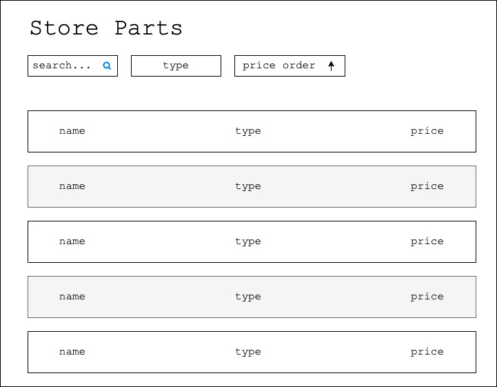
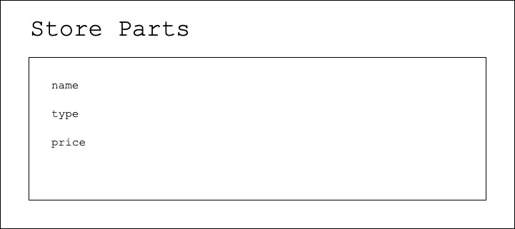

# STORE-PARTS-EXERCISE

Hello there!
If you're here, chances are somebody at Mozantech thinks you're talented.
This exercise is part of our recruitment process. 
It is designed to help us understand some of your competencies before moving forward.
## Goal

We have a few requirements for you to follow but we want you to build this with your own style and ideas.

The main goal of the exercise is to build a Single Page Application to extend this super robust API. 

ᕕ༼ ຈل͜ຈ༽ ᕗ 

What you must have:

- Two different routes
- The possibility to order by price implemented on the SPA side
- A way to request different parts by type
- The ability to request different search queries on typing
- Create a public repo to share your work with us
- An accurate README to show us how to run your app
- You should not change this service

What we value:

- Static typing
- Eslint
- Unit tests
- Your unique skills

Please note that there is no harm if you are not able to meet any of these points. If you are not into designing, a simple UI like this is more than enough for the exercise as long as you add some colors.

Good luck! ♨(⋆‿⋆)♨

#### Main page



#### Parts page



## API Documentation

To run the API you will just need the basics.

```
yarn
yarn start
```

or

```
npm install
npm run start
```

You should be able to see the service starting on port `8081`. After that, you would be able to access the following enpoints:

- `/store/parts` to get the all the parts Here you can use the query params `type` and `query` to filter the parts either by type, your query or both.

- `/store/part-types` to get the part types
